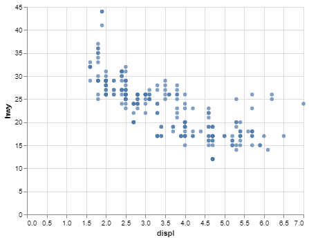

# Project 0

_Samantha Staheli_

## Project Summary

_In Project 0, I learned how to create and save an altair chart, create a markdown file, and use Jupyter Notebook._

## Technical Details

#### Grand Question 1
__Finish the readings and come to class prepared with any questions to get your environment working smoothly.__

I finished the reading before class.

#### Grand Question 2
__In VS Code, write a python script to create the example Altair chart from section 3.2.2 of the textbook (part of the assigned readings). Note that you have to type chart to see the Altair chart after you create it. Save your Altair chart as a .png image. This image will be inserted into your final pdf report.__



#### Grand Question 3
__Your final report should also include the markdown table created from the following code. (Assuming you have mpg from Question 2.)__

| manufacturer   | model   |   year |   hwy |
|:---------------|:--------|-------:|------:|
| audi           | a4      |   1999 |    29 |
| audi           | a4      |   1999 |    29 |
| audi           | a4      |   2008 |    31 |
| audi           | a4      |   2008 |    30 |
| audi           | a4      |   1999 |    26 |

## Appendix A
```{python}
# # Project 0

# ## Question 2

# get libraries
import pandas as pd
import altair as alt

# get data
# store data in global variables so can be used throughout code
url = "https://github.com/byuidatascience/data4python4ds/raw/master/data-raw/mpg/mpg.csv"
mpg = pd.read_csv(url)

# create altair chart using the data variables 
chart = (alt.Chart(mpg)
  .encode(
    x='displ', 
    y='hwy')
  .mark_circle()
)
chart

# ## Question 3

# create markdown table
print(mpg
  .head(5)
  .filter(["manufacturer", "model","year", "hwy"])
  .to_markdown(index=False))
```