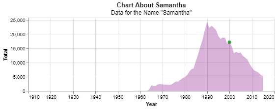
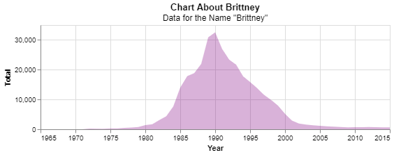
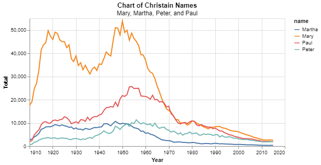
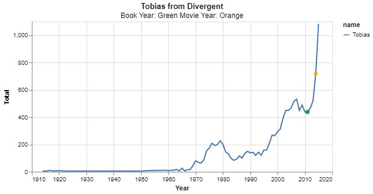

# Project 1

_Samantha Staheli_

## Project Summary
This project examines the total of names by state and total. The data ranges from the years 1910-2015. The names examined are Samantha, Mary, Martha, Peter, Paul, and Tobias.  

## Technical Details

#### Grand Question 1 
_How does your name at your birth year compare to its use historically?_
About 17,500 people were named Samantha in the year I was born, which is the year 2000. The highest total of people named Samantha was 25,000 in the year 1990. The data stops at 2015, so I assume that no one was named Samantha after that year. 



#### Grand Question 2
_If you talked to someone named Brittany on the phone, what is your guess of his or her age? What ages would you not guess?_

Based on people I've met and celebrities with the name Brittany I would guess their age is around 25-40. There were a few girls named Brittany at my high school and of course there is Brittany Spears. Since Brittany Spears was popular in the 90s and early 2000s, people would name their kids Brittany around that time making their age today around 25. Also, Brittany Spears is almost 40, so I would guess someone named Brittany is around that age. 

I would not guess an age under 5 because that name is no longer popular and I have not met anyone who has recently named their child Brittany. 

__Chart of name "Brittney":__


#### Grand Question 3
_Mary, Martha, Peter, and Paul are all Christian names. From 1920 to 2000, compare the name usage of each of the four names._
The most popular name is Mary. The highest total of people named Mary was in 1950 with a total of 55,000 people. The second most popular name is Paul. Paul was most popular in 1953 with a total of 25,000 people. Based on the data from year 1990-2020, these Christain names have become less popular. Now the total for the each of the names is less than 5,000. 



#### Grand Question 4
_Think of a unique name from a famous movie. Plot the usage of that name and see how changes line up with the movie release._
The unique name I chose was Tobias from Divergent. The total of people named Tobias increased when the book was released in 2011 and continued to increase until 2015. 

The following chart shows the year the book was published as a green dot and the year the movie came out as a yellow dot.



## Appendix A
```python
# %% [markdown]
# # Project 1

# %%
# Import Python Libraries
import pandas as pd 
import altair as alt 

# %%
# Get Data and Store in Variables
url = 'https://github.com/byuidatascience/data4names/raw/master/data-raw/names_year/names_year.csv'
names = pd.read_csv('names_year.csv')

# %% [markdown]
# ## Question 1

# %%
# Get Data for My Name
samantha = names.query('name == "Samantha"')
print(samantha)

# %%
# Create Chart for 'Samantha'
samantha_chart = (alt.Chart(samantha)
    .mark_area(opacity=0.3, color='purple')
    .encode(x = alt.X('year', axis = alt.Axis(format = 'd', title = 'Year')), y = 'Total')
    .properties(
        height = 150,
        width = 500,
        title = {'text': 'Chart About Samantha', 'subtitle': 'Data for the Name "Samantha"'}
    )
)

# %%
my_bday = samantha.query('year == 2000')

bday_point = (alt.Chart(my_bday)
    .mark_circle(color = 'green', size = 50)
    .encode(x = 'year', y = 'Total')
    )

# %%
# Combine Charts Together
samantha_chart + bday_point

# %% [markdown]
# ## Question 2

# %%
brittney = names.query('name == "Brittany"')
print(brittney)

# %%
brittney_chart = (alt.Chart(brittney)
    .mark_area(opacity=0.3, color='purple')
    .encode(x = alt.X('year', axis = alt.Axis(format = 'd', title = 'Year')), y = 'Total')
    .properties(
        height = 150,
        width = 500,
        title = {'text': 'Chart About Brittney', 'subtitle': 'Data for the Name "Brittney"'}
    )
)
brittney_chart

# %% [markdown]
# ## Question 3

# %% [markdown]
# ### Mary, Martha, Peter, and Paul

# %%
name_list = ['Mary', 'Martha', 'Peter', 'Paul']

names = (names.query('name in @name_list'))

name_chart = (alt.Chart(names)
    .mark_line()
    .encode(
        x = alt.X('year', axis = alt.Axis(format = 'd', title = 'Year')),
        y = 'Total',
        color = 'name')
    .properties(
        height = 250,
        width = 500,
        title = {'text': 'Chart of Christain Names', 'subtitle': 'Mary, Martha, Peter, and Paul'}
    )
        )

# %%
name_chart

# %% [markdown]
# ## Question 4

# %%
unique_name_list = ['Tobias']

unique_name = (names.query('name in @unique_name_list'))

unique_name_chart = (alt.Chart(unique_name)
    .mark_line(color='green')
    .encode(
        x = alt.X('year', axis = alt.Axis(format = 'd', title = 'Year')),
        y = 'Total',
        color = 'name')
    .properties(
        height = 250,
        width = 500,
        title = {'text': 'Tobias from Divergent', 'subtitle': 'Book Year: Green Movie Year: Orange'}
    )
        )
unique_name_chart

# %%
# Year of Movie
movie_year = unique_name.query('year == 2014')

movie_year_point = (alt.Chart(movie_year)
    .mark_circle(color = 'orange', size = 50)
    .encode(x = 'year', y = 'Total')
    )

# %%
# Year of Book Release
book_year = unique_name.query('year == 2011')

book_year_point = (alt.Chart(book_year)
    .mark_circle(color = 'green', size = 50)
    .encode(x = 'year', y = 'Total')
    )

# %%
unique_name_chart + movie_year_point + book_year_point
```
