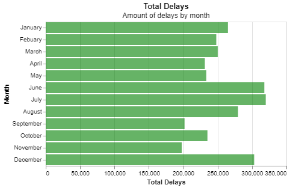
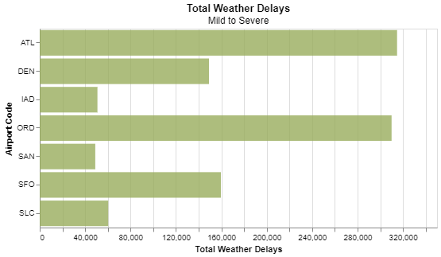

# Project 2:  Are we missing JSON on our flight?

__Samantha Staheli__

## Project Summary

_This project uses data about delayed flights. The data contains different types of delays in minutes and by count. The delays are associated with the name of the airport, month, and year._

## Technical Details

#### Grand Question 1
_Which airport has the worst delays?_
The airport with the highest delay average is Chicago O'Hare International, with an average delay in hours of 1.1305. The average difference between Chicago O'Hare International's and the other airports average delay hours is 0.2. 

| airport_code   |   total_flights |   total_delays |   total_delay_min |   prop_delays |   avg_delay_hrs |
|:---------------|----------------:|---------------:|------------------:|--------------:|----------------:|
| ATL            |         4430047 |         902443 |          53983926 |      0.20371  |        0.996996 |
| DEN            |         2513974 |         468519 |          25173381 |      0.186366 |        0.895495 |
| IAD            |          851571 |         168467 |          10283478 |      0.197831 |        1.01736  |
| ORD            |         3597588 |         830825 |          56356129 |      0.230939 |        1.13053  |
| SAN            |          917862 |         175132 |           8276248 |      0.190804 |        0.78762  |
| SFO            |         1630945 |         425604 |          26550493 |      0.260955 |        1.03972  |
| SLC            |         1403384 |         205160 |          10123371 |      0.146189 |        0.822396 |

It could be argued that the worst delay is from weather. This is because weather cannot be controled. The airport with the most delays from weather is Hartsfield-Jackson Atlanta. The total delays from weather for the Atlanta airport is 32375. 	

| airport_code   |   total_delay_weather |
|:---------------|----------------------:|
| ATL            |                 32375 |
| DEN            |                 13836 |
| IAD            |                  4794 |
| ORD            |                 20765 |
| SAN            |                  4320 |
| SFO            |                 10377 |
| SLC            |                  6831 |

Code used to make calculations:
```{python}
# find max aver delay hrs for airport code
highest_delay_avg = max(q1_table.avg_delay_hrs)

# create new table so can edit data
delay_dif_table = q1_table

# replace highest value with nan
delay_dif_table.avg_delay_hrs.replace(highest_delay_avg, np.nan, inplace=True)

# find difference between ORD avg and all other airports
delay_dif = delay_dif_table.avg_delay_hrs - highest_delay_avg
avg_dif = delay_dif.mean()
```
#### Grand Question 2
_What is the best month to fly if you want to avoid delays of any length?_ 
November is the best month to fly if one wants to avoid delays. The month of November has the least amount of delays compared to all other months. November has less than 200,000 delays total. 



#### Grand Question 3
_Your job is to create a new column that calculates the total number of flights delayed by weather (either severe or mild)._
|    | airport_code   |   total_weather_delays |   total_flights |   severe |   mild_late |   mild_nas |   percent_delay_weather |
|---:|:---------------|-----------------------:|----------------:|---------:|------------:|-----------:|------------------------:|
|  0 | SFO            |               159594   |         1630945 |    10377 |     37251   |   111966   |                 9.78535 |
|  1 | ORD            |               309954   |         3597588 |    20765 |     81045.1 |   208144   |                 8.61561 |
|  2 | ATL            |               314801   |         4430047 |    32375 |     70680.5 |   211745   |                 7.10603 |
|  3 | IAD            |                50842.7 |          851571 |     4794 |     19451.1 |    26597.5 |                 5.97045 |
|  4 | DEN            |               149107   |         2513974 |    13836 |     54000.3 |    81270.7 |                 5.93113 |
|  5 | SAN            |                48920.6 |          917862 |     4320 |     21180.3 |    23420.2 |                 5.32984 |
|  6 | SLC            |                60345.8 |         1403384 |     6831 |     23835.3 |    29679.5 |                 4.30002 |

#### Grand Question 4
_Create a barplot showing the proportion of all flights that are delayed by weather at each airport._ 


#### Grand Question 5
_Fix all of the varied missing data types in the data to be consistent (all missing values should be displayed as “NaN”) and save the new data as a JSON file._

I updated the months, minutes delayed carrier, and number delays late aircraft.

JSON file:
```python
[
    {
        "airport_code": "ATL",
        "airport_name": "Atlanta, GA: Hartsfield-Jackson Atlanta International",
        "month": "January",
        "year": 2005.0,
        "num_of_flights_total": 35048,
        "num_of_delays_carrier": "1500+",
        "num_of_delays_late_aircraft": 1109.1040723982,
        "num_of_delays_nas": 4598,
        "num_of_delays_security": 10,
        "num_of_delays_weather": 448,
        "num_of_delays_total": 8355,
        "minutes_delayed_carrier": 116423.0,
        "minutes_delayed_late_aircraft": 104415,
        "minutes_delayed_nas": 207467.0,
        "minutes_delayed_security": 297,
        "minutes_delayed_weather": 36931,
        "minutes_delayed_total": 465533
    },
    {
        "airport_code": "DEN",
        "airport_name": "Denver, CO: Denver International",
        "month": "January",
        "year": 2005.0,
show more (open the raw output data in a text editor) ...

        "minutes_delayed_security": 158,
        "minutes_delayed_weather": 6693,
        "minutes_delayed_total": 107269
    }
]
```

## Appendix A
```python

# # Project 2

# %%
import pandas as pd   # to load and transform data
import numpy as np    # for math/stat calculations
import altair as alt
import json

# %%
# load flights data
flight_url = 'https://raw.githubusercontent.com/byuidatascience/data4missing/master/data-raw/flights_missing/flights_missing.json'
flights = pd.read_json(flight_url)
flights.head()

# ## Question 1

# %%
# average of minutes_delayed_total for each airport
q1_table = (flights
    .groupby('airport_code')
    .agg(total_flights = ('num_of_flights_total', sum),
        total_delays = ('num_of_delays_total', sum),
        total_delay_min = ('minutes_delayed_total', sum),
        # av_delay_mins = ('minutes_delayed_total', 'mean')
        )
    .assign(prop_delays = lambda x: x.total_delays / x.total_flights,
            avg_delay_hrs = lambda x: x.total_delay_min / x.total_delays / 60
            )
    .reset_index()
)

# print makes table more organized 
# index=False gets rid of index column 
print(q1_table.to_markdown(index=False))

# %%
# find max aver delay hrs for airport code
highest_delay_avg = max(q1_table.avg_delay_hrs)
print(highest_delay_avg)

# %%
# create new table so can edit data
delay_dif_table = q1_table
# replace highest value with nan
delay_dif_table.avg_delay_hrs.replace(highest_delay_avg, np.nan, inplace=True)
# print(delay_dif_table)
# find difference between ORD avg and all other airports
delay_dif = delay_dif_table.avg_delay_hrs - highest_delay_avg
avg_dif = delay_dif.mean()
print(avg_dif)


# %%
# worst weather delay
q1_weather = (flights
    .groupby('airport_code')
    .agg(total_delay_weather = ('num_of_delays_weather', sum)
        )
    .assign()
    .reset_index()
)

print(q1_weather.to_markdown(index=False))
print(max(q1_weather.total_delay_weather))

# ## Question 2

# %%
# fill in na months
# should've worked but didn't
# flights.month.replace('n/a', np.nan)
# flights.month.fillna(method='bfill')
# mdata = flights
# mdata.month.replace('n/a', np.nan).fillna(method='bfill', inplace=True)
mdata = flights.query('month != "n/a"')

# %%
mdata.month.value_counts(dropna=False)

# %%
q2_table = (mdata
    .groupby('month')
    .agg(total_flights = ('num_of_flights_total', sum),
        total_delays = ('num_of_delays_total', sum),
        total_delay_min = ('minutes_delayed_total', sum),
        # av_delay_mins = ('minutes_delayed_total', 'mean')
        )
    .assign(prop_delays = lambda x: x.total_delays / x.total_flights,
            avg_delay_hrs = lambda x: x.total_delay_min / x.total_delays / 60
            )
    .reset_index()
)

# print makes table more organized 
# index=False gets rid of index column 
print(q2_table.to_markdown(index=False))

# %%
# chart code from q1
q2_chart = (alt.Chart(q2_table)
    .mark_bar(color='green', opacity=0.6)
    .encode(
        x = alt.X('total_delays', axis=alt.Axis(title = 'Total Delays')), 
        y = alt.Y('month', axis=alt.Axis(title='Month'), sort=['January', 'Febuary', 'March', 'April', 'May', 'June', 'July', 'August', 'September', 'October', 'November', 'December']))
    .properties(width=400,
                title= {'text': 'Total Delays', 'subtitle': 'Amount of delays by month'}
                )
    )
q2_chart

# ## Question 3

# %%
flights.num_of_delays_weather.value_counts(dropna=False)

# %%
# make copy of data so don't mess it up/change OG data
q3_data = flights

# replace -999 with NaN
q3_data.num_of_delays_late_aircraft.replace(-999, np.nan, inplace=True)

# find mean of data
late_delay_mean = q3_data.num_of_delays_late_aircraft.mean()

# replace NaN data with the mean
new_data = q3_data.num_of_delays_late_aircraft.fillna(value=late_delay_mean, inplace=True)

weather = q3_data.assign(
    severe = q3_data.num_of_delays_weather,
    mild_late = 0.3*q3_data.num_of_delays_late_aircraft,
    mild_nas = np.where(q3_data.month.isin(['April', 'May', 'June', 'July', 'August']), 
                0.4*q3_data.num_of_delays_nas,
                0.65*q3_data.num_of_delays_nas),
    total = lambda x: x.severe + x.mild_late + x.mild_nas
)

# average of minutes_delayed_total for each airport
q3_table = (weather
    .groupby('airport_code')
    .agg(total_weather_delays = ('total', sum),
        total_flights = ('num_of_flights_total', sum),
        severe = ('severe', sum),
        mild_late = ('mild_late', sum),
        mild_nas = ('mild_nas', sum)
        )
    .assign(percent_delay_weather = lambda x: x.total_weather_delays / x.total_flights * 100)
    .sort_values(by = 'percent_delay_weather', ascending = False)
    .reset_index()
)

# print makes table more organized 
# index=False gets rid of index column 
print(q3_table.to_markdown())

# ## Question 4

# %%
(alt.Chart(q3_table)
    .mark_bar(color='#98AC5D', opacity=0.8)
    .encode(x = alt.X('total_weather_delays', axis=alt.Axis(title='Total Weather Delays')),
        y = alt.Y('airport_code', axis=alt.Axis(title='Airport Code'))
        )
    .properties(
        height = 250,
        width = 500,
        title = {'text': 'Total Weather Delays', 'subtitle': 'Mild to Severe'}
    )    
)

# ## Question 5

# ### Data That is Missing/Incorrect

# %%
# create new variable for data
updated_data = flights
updated_data.head(100)

# %%
# tried to fill in missing airport name with their airport code 
# for i in updated_data:
#     if updated_data.airport_name == updated_data.airport_name.empty:
#         updated_data.airport_name.replace(updated_data.airport_name.empty, updated_data.airport_code[i])
#     i += 1

# %%
# replace 1500+ string with number
updated_data.num_of_delays_carrier.replace('1500+', 1500)

# %%
# fill in missing months
updated_data.month.replace('n/a', np.nan).fillna(method='bfill')

# %%
# replace nan for num_of_delays_late_aircraft
# replace -999 with NaN
updated_data.num_of_delays_late_aircraft.replace(-999, np.nan, inplace=True)

# find mean of data
late_delay_mean = updated_data.num_of_delays_late_aircraft.mean()

# replace NaN data with the mean
new_data = updated_data.num_of_delays_late_aircraft.replace(np.nan, late_delay_mean, inplace=True)
updated_data.head()

# %%
# replace nan for minutes_delayed_carrier
# find mean of data
delay_mean = updated_data.minutes_delayed_carrier.mean()

# replace NaN data with the mean
new_data = updated_data.minutes_delayed_carrier.replace(np.nan, delay_mean, inplace=True)
updated_data.head()

# %%
json_data = flights.to_json(orient="records")
json_object = json.loads(json_data)
json_formatted_str = json.dumps(json_object, indent = 4)
print(json_formatted_str)
```