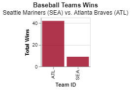
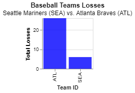

# Project 3
## Finding relationships in baseball

__Samantha Staheli__

## Project Summary

_This project uses the data of baseball players and teams. It covers their salary, number of at bats, number of hits, and a corresponding year. SQL, pandas, and altair is used to make new tables and charts; which show calculations and comparisons._

## Technical Details

#### Grand Question 1
__Write an SQL query to create a new dataframe about baseball players who attended BYU-Idaho. The new table should contain five columns: playerID, schoolID, salary, and the yearID/teamID associated with each salary. Order the table by salary (highest to lowest) and print out the table in your report.__

The table created shows there are 15 players who attended BYU-I. The salries range from 150,000 to 400,000.

|    | playerid   |   salary | teamid   |   yearid | schoolid   |
|---:|:-----------|---------:|:---------|---------:|:-----------|
|  0 | stephga01  |   150000 | PHI      |     1997 | idbyuid    |
|  1 | stephga01  |   185000 | PHI      |     1998 | idbyuid    |
|  2 | stephga01  |   215000 | SLN      |     1999 | idbyuid    |
|  3 | lindsma01  |   380000 | FLO      |     2007 | idbyuid    |
|  4 | lindsma01  |   395000 | FLO      |     2008 | idbyuid    |
|  5 | lindsma01  |   410000 | FLO      |     2009 | idbyuid    |
|  6 | stephga01  |   550000 | SLN      |     2000 | idbyuid    |
|  7 | stephga01  |   800000 | SLN      |     2003 | idbyuid    |
|  8 | stephga01  |   900000 | SLN      |     2002 | idbyuid    |
|  9 | stephga01  |  1025000 | SLN      |     2001 | idbyuid    |
| 10 | lindsma01  |  1625000 | HOU      |     2010 | idbyuid    |
| 11 | lindsma01  |  2300000 | CHA      |     2013 | idbyuid    |
| 12 | lindsma01  |  2800000 | COL      |     2011 | idbyuid    |
| 13 | lindsma01  |  3600000 | BAL      |     2012 | idbyuid    |
| 14 | lindsma01  |  4000000 | CHA      |     2014 | idbyuid    |

Query Used:
```sql
SELECT DISTINCT salaries.playerid, salaries.salary, salaries.teamid, salaries.yearid, collegeplaying.schoolid
FROM salaries AS sal
    JOIN collegeplaying AS cp ON sal.playerid = cp.playerid
 WHERE collegeplaying.schoolid = "idbyuid"
 ORDER BY salaries.salary
```

#### Grand Question 2
The following queries compute the batting average for each player. The batting average calulation is number of hits divided by the number of at-bats.

__a) Write an SQL query that provides playerID, yearID, and batting average for players with at least 1 at bat that year. Sort the table from highest batting average to lowest, and then by playerid alphabetically. Show the top 5 results in your report.__ 

Query Used:
```sql
SELECT batting.playerid, batting.yearid, (batting.h / batting.ab) AS batting_av 
FROM batting
WHERE batting.ab >= 1
GROUP BY batting.playerid, batting.yearid
ORDER BY batting_av DESC, batting.playerid
LIMIT 5
```
Result:
|    | playerid   |   yearid |   batting_av |
|---:|:-----------|---------:|-------------:|
|  0 | abernte02  |     1960 |            1 |
|  1 | abramge01  |     1923 |            1 |
|  2 | acklefr01  |     1964 |            1 |
|  3 | alanirj01  |     2019 |            1 |
|  4 | alberan01  |     2017 |            1 |

__b) Use the same query as above, but only include players with at least 10 at bats that year. Print the top 5 results.__

Query Used:
```sql
SELECT batting.playerid, batting.yearid, (batting.h / batting.ab) AS batting_av 
FROM batting
WHERE batting.ab >= 10
GROUP BY batting.playerid, batting.yearid
ORDER BY batting_av DESC, batting.playerid
LIMIT 5
```
Result:
|    | playerid   |   yearid |   batting_av |
|---:|:-----------|---------:|-------------:|
|  0 | nymanny01  |     1974 |     0.642857 |
|  1 | carsoma01  |     2013 |     0.636364 |
|  2 | altizda01  |     1910 |     0.6      |
|  3 | silvech01  |     1948 |     0.571429 |
|  4 | puccige01  |     1930 |     0.5625   |

__c) Now calculate the batting average for players over their entire careers (all years combined). Only include players with at least 100 at bats, and print the top 5 results.__

Query Used:
```sql
SELECT batting.playerid, (sum(batting.h) / sum(batting.ab)) AS batting_av 
FROM batting
GROUP BY batting.playerid
HAVING sum(batting.ab) >= 100
ORDER BY batting_av DESC, batting.playerid 
LIMIT 5
```
Result:
|    | playerid   |   batting_av |
|---:|:-----------|-------------:|
|  0 | cobbty01   |     0.366299 |
|  1 | barnero01  |     0.359682 |
|  2 | hornsro01  |     0.358497 |
|  3 | jacksjo01  |     0.355752 |
|  4 | meyerle01  |     0.355509 |
#### Grand Question 3
__Pick any two baseball teams and compare them using a metric of your choice (average salary, home runs, number of wins, etc). Write an SQL query to get the data you need, then make a graph in Altair to visualize the comparison.__

The teams I choose to compare are the Seattle Mariners and Atlanta Braves. I compared the number of series wins and loses each team has. 

__Wins__
Wins Query:
```sql
SELECT SeriesPost.teamidwinner, SUM(SeriesPost.wins) AS total_wins
FROM SeriesPost
WHERE SeriesPost.teamidwinner = "ATL" OR SeriesPost.teamidwinner = "SEA"
GROUP BY SeriesPost.teamidwinner
ORDER BY SeriesPost.teamidwinner
```

Wins Table:
|    | teamidwinner   |   total_wins |
|---:|:---------------|-------------:|
|  0 | ATL            |           42 |
|  1 | SEA            |            9 |



__Losses__
Losses Query:
```sql
SELECT SeriesPost.teamidloser, SUM(SeriesPost.losses) AS total_losses
FROM SeriesPost
WHERE SeriesPost.teamidloser = "ATL" OR SeriesPost.teamidloser = "SEA"
GROUP BY SeriesPost.teamidloser
ORDER BY SeriesPost.teamidloser
```

Losses Table:
|    | teamidloser   |   total_losses |
|---:|:--------------|---------------:|
|  0 | ATL           |             26 |
|  1 | SEA           |              6 |



## Appendix A
```python
# %% [markdown]
# # Project 3

# %%
import datadotworld as dw
import pandas as pd
import altair as alt
import numpy as np

# %% [markdown]
# ## Question 1

# %% [markdown]
# ### byui id: "idbyuid"

# %%
byui_players = dw.query('byuidss/cse-250-baseball-database', 
'''
SELECT DISTINCT salaries.playerid, salaries.salary, salaries.teamid, salaries.yearid, collegeplaying.schoolid 
FROM salaries AS sal
    JOIN collegeplaying AS cp ON sal.playerid = cp.playerid
 WHERE collegeplaying.schoolid = "idbyuid"
 ORDER BY salaries.salary
''')
q1_table = byui_players.dataframe
print(q1_table.to_markdown())

# %%
(alt.Chart(q1_table)
    .mark_bar(color='#98AC5D', opacity=0.8)
    .encode(x = alt.X('salary', axis=alt.Axis(title='Salary')),
        y = alt.Y('playerid', axis=alt.Axis(title='Player ID'))
        )
    .properties(
        title = {'text': 'BYU-I Baseball Players Salaries'}
    )    
)

# %% [markdown]
# ## Question 2

# %% [markdown]
# ### q2a 

# %%
q2a = dw.query('byuidss/cse-250-baseball-database', 
'''
SELECT batting.playerid, batting.yearid, (batting.h / batting.ab) AS batting_av 
FROM batting
WHERE batting.ab >= 1
GROUP BY batting.playerid, batting.yearid
ORDER BY batting_av DESC, batting.playerid
LIMIT 5
''')
print(q2a.dataframe.to_markdown())


# %% [markdown]
# ### q2b

# %%
q2b = dw.query('byuidss/cse-250-baseball-database', 
'''
SELECT batting.playerid, batting.yearid, (batting.h / batting.ab) AS batting_av 
FROM batting
WHERE batting.ab >= 10
GROUP BY batting.playerid, batting.yearid
ORDER BY batting_av DESC, batting.playerid
LIMIT 5
''')
print(q2b.dataframe.to_markdown())

# %% [markdown]
# ### q2c

# %%
q2c = dw.query('byuidss/cse-250-baseball-database', 
'''
SELECT batting.playerid, (sum(batting.h) / sum(batting.ab)) AS batting_av 
FROM batting
GROUP BY batting.playerid
HAVING sum(batting.ab) >= 100
ORDER BY batting_av DESC, batting.playerid 
LIMIT 5
''')
print(q2c.dataframe.to_markdown())

# %% [markdown]
# ## Question 3

# %% [markdown]
# ### Seattle Mariners (SEA) vs. Atlanta Braves (ATL)

# %%
q3_query = dw.query('byuidss/cse-250-baseball-database', 
'''
SELECT SeriesPost.teamidwinner, SUM(SeriesPost.wins) AS total_wins
FROM SeriesPost
WHERE SeriesPost.teamidwinner = "ATL" OR SeriesPost.teamidwinner = "SEA"
GROUP BY SeriesPost.teamidwinner
ORDER BY SeriesPost.teamidwinner
''')
q3_table = q3_query.dataframe
print(q3_table.to_markdown())
#  SUM(SeriesPost.losses) AS total_losses, SUM(SeriesPost.ties) AS total_ties

# %%
q3_query2 = dw.query('byuidss/cse-250-baseball-database', 
'''
SELECT SeriesPost.teamidloser, SUM(SeriesPost.losses) AS total_losses
FROM SeriesPost
WHERE SeriesPost.teamidloser = "ATL" OR SeriesPost.teamidloser = "SEA"
GROUP BY SeriesPost.teamidloser
ORDER BY SeriesPost.teamidloser
''')
q3_table2 = q3_query2.dataframe
print(q3_table2.to_markdown())

# %%
(alt.Chart(q3_table)
    .mark_bar(color="#9a031e", opacity=0.8)
    .encode(x = alt.X('teamidwinner', axis=alt.Axis(title='Team ID')),
        y = alt.Y('total_wins', axis=alt.Axis(title='Total Wins'))
        )
    .properties(
        height = 100,
        width = 100,
        title = {'text': 'Baseball Teams Wins', 'subtitle': 'Seattle Mariners (SEA) vs. Atlanta Braves (ATL)'}
    )    
)

# %%
(alt.Chart(q3_table2)
    .mark_bar(color="blue", opacity=0.8)
    .encode(x = alt.X('teamidloser', axis=alt.Axis(title='Team ID')),
        y = alt.Y('total_losses', axis=alt.Axis(title='Total Losses'))
        )
    .properties(
        height = 100,
        width = 100,
        title = {'text': 'Baseball Teams Losses', 'subtitle': 'Seattle Mariners (SEA) vs. Atlanta Braves (ATL)'}
    )    
)
```