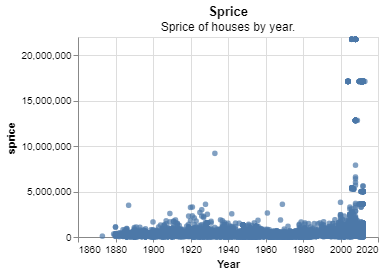
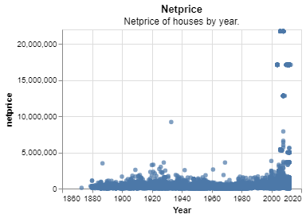
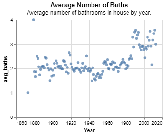
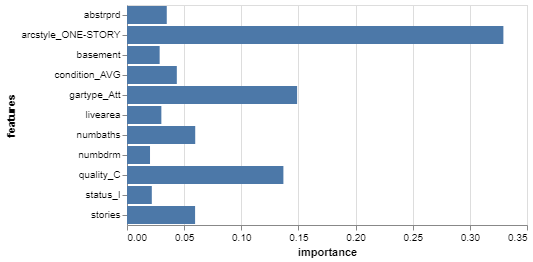
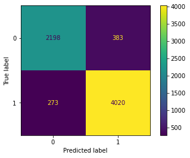

# Project 4: Classifying Homes

__Samantha Staheli__

## Project Summary

_This project introduces machine learning with data science programming. The data used is of individual homes and characteriscs of each home. The machince learning model made in this project catorgorizes these homes by whether they were built before or after 1980. To determine the best features to classify the homes, I compared the mean of several characteristics in the data of the homes built before 1980 to the ones after 1980._

## Technical Details

#### Grand Question 1
__Create 2-3 charts that evaluate potential relationships between the houses variables and the varibales before1980. Explain what you learn from the charts that could help a machine learning algorithm.__

To determine the best relationships between the houses variables, I compared the mean of houses build before 1980 to houses built after. Based on these comparisons the best classifers are sprice, netprice, and numbaths.

__comparison table:__
| before1980   |       avg_sprice |     avg_netprice |   avg_numbaths |
|:-------------|-----------------:|-----------------:|---------------:|
| False        |      1.08763e+06 |      1.08643e+06 |        2.98173 |
| True         | 246300           | 244884           |        1.97311 |

__all comparisons:__
| before1980   |   avg_nbhd |   avg_livearea |   avg_finbsmnt |   avg_basement |   avg_totunits |   avg_stories |   avg_nocars |   avg_floorlvl |   avg_numbdrm |   avg_numbaths |       avg_sprice |     avg_netprice |   avg_deduct |         avg_tasp |
|:-------------|-----------:|---------------:|---------------:|---------------:|---------------:|--------------:|-------------:|---------------:|--------------:|---------------:|-----------------:|-----------------:|-------------:|-----------------:|
| False        |    301.825 |        1878.92 |        300.081 |        570.323 |       0.999302 |       1.76437 |      1.56667 |        7.15064 |       2.63021 |        2.98173 |      1.08763e+06 |      1.08643e+06 |      1205.48 |      1.09088e+06 |
| True         |    449.003 |        1289.84 |        348.776 |        497.001 |       1.02996  |       1.21307 |      1.2401  |        3.41595 |       2.45715 |        1.97311 | 246300           | 244884           |      1415.85 | 247491           |

__sprice chart:__


__netrpice chart:__


__numbaths chart:__


#### Grand Question 2
__Build a classification model labeling houses as being built “before 1980” or “during or after 1980”. Your goal is to reach 90% accuracy. Explain your final model choice (algorithm, tuning parameters, etc) and describe what other models you tried.__

The percentage I got is 90.457%. To get this percentage I used the gradient boost classifer. I choose this classifer because its result was the hightest. 

```
# create a classification model
classifier_GB = GradientBoostingClassifier()

# train the model
classifier_GB.fit(x_train, y_train)

# use your model to make predictions!
y_predicted = classifier_GB.predict(x_test)

# test how accurate those predictions are
metrics.accuracy_score(y_test, y_predicted)
```
#### Grand Question 3
__Justify your classification model by discussing the most important features selected by your model. This discussion should include a chart and a description of the features.__

The features used in the classification model is every characteristic but year built, the before1980 variable, and parcel number. 

The following feature importance chart shows that the feature that trained the model the most was arcstyle_ONE-STORY.



#### Grand Question 4
__Describe the quality of your classification model using 2-3 different evaluation metrics. You also need to explain how to interpret each of the evaluation metrics you use.__

__The matrix model for my model is:__


__Classsification Report:__

                precision    recall  f1-score   support

           0       0.89      0.85      0.87      2581
           1       0.91      0.94      0.92      4293

    accuracy                           0.90      6874
   macro avg       0.90      0.89      0.90      6874
weighted avg       0.90      0.90      0.90      6874

These calculations were made using the following precision, recall, and balanced accuracy funcitons. 

__precision:__

$precision = \frac{number \ true \ positives}{number \ true \ positives \ + \ number \ false \ positives}$

__recall:__

$recall = \frac{number \ true \ positives}{number \ true \ positives \ + \ number \ false \ negatives}$

__balanced accuracy:__

$\frac{recall \ + \ precison}{2}$

## Appendix A

_This is where your python script will go. Your code should be commented and well organized._

```python
# %% [markdown]
# # Project 4

# %% [markdown]
# ## load code

# %% [markdown]
# 

# %%
import pandas as pd
import altair as alt
import numpy as np 
import datadotworld as dw

from sklearn.model_selection import train_test_split
from sklearn.naive_bayes import GaussianNB
from sklearn import metrics

from sklearn.tree import DecisionTreeClassifier
from sklearn import tree
from sklearn.ensemble import RandomForestClassifier
from sklearn.ensemble import GradientBoostingClassifier

alt.data_transformers.enable('json')

# %%
denver_url = 'https://raw.githubusercontent.com/byuidatascience/data4dwellings/master/data-raw/dwellings_denver/dwellings_denver.csv'
dwellings_denver = pd.read_csv(denver_url)

# %%
ml_url = 'https://raw.githubusercontent.com/byuidatascience/data4dwellings/master/data-raw/dwellings_ml/dwellings_ml.csv'
dwellings_ml = pd.read_csv(ml_url)
# has before1980 column 

# %% [markdown]
# ## question 1

# %%
dwellings_denver['before1980'] = dwellings_denver.yrbuilt < 1980
averages = (dwellings_denver.groupby('before1980')
            .agg(avg_sprice = ('sprice', np.mean),
                avg_netprice = ('netprice', np.mean),
                avg_numbaths = ('numbaths', np.mean)
                )    
            )
print(averages.to_markdown())

# %% [markdown]
# best features:
# - sprice
# - netprice
# - numbaths
# 
# other:
# - avg_condition = ('condition', np.mean)
# - avg_quality = ('quality', np.mean)
# - avg_arcstyle = ('arcstyle', np.mean)

# %%
beforeyr1980 = dwellings_denver.yrbuilt <= 1980

# %%
# dwellings_denver['year'] = dwellings_denver.yrbuilt < 1980
year_vs_arcstyle = (dwellings_denver
            .groupby('arcstyle')
            .agg(num_built = ('yrbuilt', np.count_nonzero))
            # .assign(b1980 = lambda x: x.year <= 1980)
            .reset_index()
            )
year_vs_arcstyle

# %%
(alt.Chart(year_vs_arcstyle)
    .mark_bar()
    .encode(x=alt.X('arcstyle', scale=alt.Scale(zero=False)),
            y='num_built') 
)

# %%
(alt.Chart(dwellings_denver)
    .mark_circle()
    .encode(x=alt.X('yrbuilt', scale=alt.Scale(zero=False), axis = alt.Axis(format = 'd', title = 'Year')), 
            y='netprice', 
            )
    .properties(
        height = 200,
        width = 300,
        title = {'text': 'Netprice', 'subtitle': 'Netprice of houses by year.'}
    )
)

# %%
(alt.Chart(dwellings_denver)
    .mark_circle()
    .encode(x=alt.X('yrbuilt', scale=alt.Scale(zero=False), axis = alt.Axis(format = 'd', title = 'Year')), 
            y='sprice', 
            )
    .properties(
        height = 200,
        width = 300,
        title = {'text': 'Sprice', 'subtitle': 'Sprice of houses by year.'}
    )
)

# %%
year_vs_bathrooms = (dwellings_denver.groupby('yrbuilt')
            .agg(avg_baths = ('numbaths', np.mean))
            .reset_index()
            )

(alt.Chart(year_vs_bathrooms)
    .mark_circle()
    .encode(x=alt.X('yrbuilt', scale=alt.Scale(zero=False), axis = alt.Axis(format = 'd', title = 'Year')), 
            y='avg_baths', 
            )
    .properties(
        height = 200,
        width = 300,
        title = {'text': 'Average Number of Baths', 'subtitle': 'Average number of bathrooms in house by year.'}
    )
)

# %% [markdown]
# ## Question 2

# %% [markdown]
# ### Organize Data

# %%
# features = dwellings_ml.filter(['sprice', 'numbaths', 'netprice'])
features = dwellings_ml.drop(columns=['before1980', 'yrbuilt', 'parcel'])

targets = dwellings_ml.before1980

# %%
x_train, x_test, y_train, y_test = train_test_split(
    features, 
    targets, 
    test_size = .3, 
    random_state = 24601) # like setting seed in r

# %% [markdown]
# ### Desison Tree

# %%
# create a classification model
classifier_GB = GradientBoostingClassifier()

# train the model
classifier_GB.fit(x_train, y_train)

# use your model to make predictions!
y_predicted = classifier_GB.predict(x_test)

# test how accurate those predictions are
metrics.accuracy_score(y_test, y_predicted)

# %% [markdown]
# ## Question 3

# %% [markdown]
# ### model matrix

# %%
metrics.plot_confusion_matrix(classifier_GB, x_test, y_test)

# %%
print(metrics.classification_report(y_test, y_predicted))


```