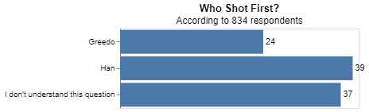

# Project 5

__Samantha Staheli__

## Project Summary

_This project uses the data from a Star Wars survey of about 800 respontents. The respondents were asked questions such as, "Do you consider yourself to be a fan of the Star Wars film franchise?". The end goal of the project was to create a model to determine if a Star Wars fan makes over $50,000 a year. Before doing this we cleaned the data by shortening the data and its headers._

## Technical Details

#### Grand Question 1
__Shorten the column names and clean them up for easier use with pandas.__

The column names were shortened to be small but still be able to understand what the name means. For example, I shortened Star Wars to sw in all the names. I also shortened the questions to amout two words. An example of this is, changing 'Have you seen' to 'seen_any_'. The new and old column names are shown in the following tables.

|    | New Names                           |
|---:|:------------------------------------|
|  0 | respondentid                        |
|  1 | have_seen_any                       |
|  2 | fan_sw                              |
|  3 | seen_any_i__the_phantom_menace      |
|  4 | seen_any_ii__attack_of_the_clones   |
|  5 | seen_any_iii__revenge_of_the_sith   |
|  6 | seen_any_iv__a_new_hope             |
|  7 | seen_any_v_the_empire_strikes_back  |
|  8 | seen_any_vi_return_of_the_jedi      |
|  9 | film_rank_i__the_phantom_menace     |
| 10 | film_rank_ii__attack_of_the_clones  |
| 11 | film_rank_iii__revenge_of_the_sith  |
| 12 | film_rank_iv__a_new_hope            |
| 13 | film_rank_v_the_empire_strikes_back |
| 14 | film_rank_vi_return_of_the_jedi     |
| 15 | char_rateing_han_solo               |
| 16 | char_rateing_luke_skywalker         |
| 17 | char_rateing_princess_leia_organa   |
| 18 | char_rateing_anakin_skywalker       |
| 19 | char_rateing_obi_wan_kenobi         |
| 20 | char_rateing_emperor_palpatine      |
| 21 | char_rateing_darth_vader            |
| 22 | char_rateing_lando_calrissian       |
| 33 | gender                              |
| 34 | age                                 |
| 35 | household_income                    |
| 36 | education                           |
| 37 | location_(census_region)            |


|    | Old Names                                    |
|---:|:---------------------------------------------|
|  0 | nan                                          |
|  1 | Response                                     |
|  2 | Response                                     |
|  3 | Star Wars: Episode I  The Phantom Menace     |
|  4 | Star Wars: Episode II  Attack of the Clones  |
|  5 | Star Wars: Episode III  Revenge of the Sith  |
|  6 | Star Wars: Episode IV  A New Hope            |
|  7 | Star Wars: Episode V The Empire Strikes Back |
|  8 | Star Wars: Episode VI Return of the Jedi     |
|  9 | Star Wars: Episode I  The Phantom Menace     |
| 10 | Star Wars: Episode II  Attack of the Clones  |
| 11 | Star Wars: Episode III  Revenge of the Sith  |
| 12 | Star Wars: Episode IV  A New Hope            |
| 13 | Star Wars: Episode V The Empire Strikes Back |
| 14 | Star Wars: Episode VI Return of the Jedi     |
| 15 | Han Solo                                     |
| 16 | Luke Skywalker                               |
| 17 | Princess Leia Organa                         |
| 18 | Anakin Skywalker                             |
| 19 | Obi Wan Kenobi                               |
| 20 | Emperor Palpatine                            |
| 21 | Darth Vader                                  |
| 22 | Lando Calrissian                             |
| 33 | Response                                     |
| 34 | Response                                     |
| 35 | Response                                     |
| 36 | Response                                     |
| 37 | Response                                     |
___
#### Grand Question 2
__Please validate that the data provided on GitHub lines up with the article by recreating 2 of their visuals and calculating 2 summaries that they report in the article.__

The two summaries I chose to validate were of males who have seen a Star Wars movie and females who have seen a Star Wars movie. The following tables show the results. 

__Summary of males who has seen a Star Wars movie.__
|     |   have_seen_any (Male) |
|:----|-----------------------:|
| Yes |        0.851107        |

__Summary of females who has seen a Star Wars movie.__
|     |   have_seen_any (Female) |
|:----|-------------------------:|
| Yes |        0.723133          |

The first visuals I recreated was who shot first. The following chart shows the three answers: Han, Greedo, and I don't understand the question.  

__Visual of who shot first__


The second visual I recreated was if they have seen any Star Wars movies.

__Visual of movies seen__


___
#### Grand Question 3
__Clean and format the data so that it can be used in a machine learning model.__

The first 3 rows of each of the tables are shown.

_a. Filter the dataset to respondents that have seen at least one film._

_b. Create a new column that converts the age ranges to a single number. Drop the age range categorical column._

|      |   age_min |
|-----:|----------:|
|    0 |        18 |
|    2 |        18 |
|    3 |        18 |

_c. Create a new column that converts the school groupings to a single number. Drop the school categorical column._

|      |   education |
|-----:|------------:|
|    0 |          12 |
|    2 |          12 |
|    3 |          14 |

_d. Create a new column that converts the income ranges to a single number. Drop the income range categorical column._

|      |   income_min |
|-----:|-------------:|
|    0 |          nan |
|    2 |            0 |
|    3 |       100000 |

_e. Create your target (also known as "y" or "label") column based on the new income range column._

```python
starwars_ml = pd.concat([ml_onehot, 
                         q3.filter(['film_ranki__the_phantom_menace', 'film_rankii__attack_of_the_clones',
       'film_rankiii__revenge_of_the_sith', 'film_rankiv__a_new_hope',
       'film_rankv_the_empire_strikes_back', 'film_rankvi_return_of_the_jedi']),
                         ml_age, 
                         ml_school, 
                         ml_income], axis=1)
```

```python
features = starwars_ml.drop(['income_min'], axis=1)
target = (starwars_ml.income_min >= 50000) * 1
```

_f. One-hot encode all remaining categorical columns._

```python
ml_onehot = pd.get_dummies(q3.filter(['fan_sw', 'seen__i__the_phantom_menace',
       'seen__ii__attack_of_the_clones', 'seen__iii__revenge_of_the_sith',
       'seen__iv__a_new_hope', 'seen__v_the_empire_strikes_back',
       'seen__vi_return_of_the_jedi', 'viewhan_solo', 'viewluke_skywalker',
       'viewprincess_leia_organa', 'viewanakin_skywalker',
       'viewobi_wan_kenobi', 'viewemperor_palpatine', 'viewdarth_vader',
       'viewlando_calrissian', 'viewboba_fett', 'viewc-3p0', 'viewr2_d2',
       'viewjar_jar_binks', 'viewpadme_amidala', 'viewyoda', 'shotfirst',
       'familiar_eu', 'fan_eu', 'fan_st', 'gender', 'age', 'household_income',
       'education', 'location_(census_region)']), drop_first=True)
```
___
#### Grand Question 4

The model I choose was gradient booster. I chose this model because it gave me the hightest results. The result of my model was 1.0. This means it had a 100% accuracy. 

```python
# have to drop all na values otherwise won't work
starwars_ml = starwars_ml.dropna()

x_train, x_test, y_train, y_test = train_test_split(
    features, 
    target, 
    test_size = .3, 
    random_state = 76)

# create a classification model
classifier_GB = GradientBoostingClassifier()

# train the model
classifier_GB.fit(x_train, y_train)

# use your model to make predictions!
y_predicted = classifier_GB.predict(x_test)

# test how accurate those predictions are
metrics.accuracy_score(y_test, y_predicted)
```
___
## Appendix A
```python
# %%
import pandas as pd
import altair as alt
import numpy as np 

from sklearn.model_selection import train_test_split
from sklearn.naive_bayes import GaussianNB
from sklearn import metrics

from sklearn.tree import DecisionTreeClassifier
from sklearn import tree
from sklearn.ensemble import RandomForestClassifier
from sklearn.ensemble import GradientBoostingClassifier

# %%
url = 'https://raw.githubusercontent.com/fivethirtyeight/data/master/star-wars-survey/StarWars.csv'
sw_responses = pd.read_csv(url, encoding='ISO-8859-1', header=None, skiprows=2) # skips first 2 rows
sw_questions = pd.read_csv(url, encoding='ISO-8859-1', header=None, nrows=2) # reads in first 2 rows

# %%
print(sw_questions)

# %% [markdown]
# ## Question 1

# %%
questions = (sw_questions.iloc[0,:]
                .replace('Have you seen any of the 6 films in the Star Wars franchise?', 'have_seen_any')
                .replace('Do you consider yourself to be a fan of the Star Wars film franchise?', 'fan_sw')
                .replace('Which of the following Star Wars films have you seen? Please select all that apply.', 'seen_any_')
                .replace('Please rank the Star Wars films in order of preference with 1 being your favorite film in the franchise and 6 being your least favorite film.', 'film_rank_')
                .replace('Please state whether you view the following characters favorably, unfavorably, or are unfamiliar with him/her.', 'char_rateing_')
                .replace('Which character shot first?', 'shot_first')
                .replace('Are you familiar with the Expanded Universe?', 'familiar_expanded')
                .replace('Do you consider yourself to be a fan of the Expanded Universe?ξ', 'fan_expanded')
                .replace('Do you consider yourself to be a fan of the Star Trek franchise?', 'star_trek_fan')
                .str.lower()
                .str.replace(' ', '_')
                .ffill()
            )

response_questions = (sw_questions.iloc[1,:]
                        .replace('Response', '')
                        .str.replace('Star Wars: Episode ', '')
                        .str.lower()
                        .str.replace(' ', '_')
                        .fillna('')
                    )

column_names = questions + response_questions

# %%
sw_responses.columns = column_names
print(column_names.to_markdown())


# %% [markdown]
# ## Question 2

# %%
print(sw_responses.query('gender == "Male"')
                .have_seen_any
                .value_counts(normalize=True).to_markdown())

# %%
print(sw_responses.query('gender == "Female"')
                .have_seen_any
                .value_counts(normalize=True).to_markdown())

# %% [markdown]
# ### who shot first:

# %%
hanshotfirst = sw_responses.shot_first.value_counts(normalize=True).reset_index()
hanshotfirst['percent'] = round(hanshotfirst.shot_first*100, 0)
hanshotfirst

# %%
shot_chart = (alt.Chart(hanshotfirst)
.mark_bar().encode(
    x=alt.X('percent', axis=None),
    y=alt.Y('index', axis=alt.Axis(title=''))
).properties(
    width=300,
    height=100,
    title= {'text': 'Who Shot First?', 'subtitle': 'According to 834 respondents'}
))

shot_labels = shot_chart.mark_text(
    align='left',
    baseline='middle',
    dx=3  # Nudges text to right so it doesn't appear on top of the bar
).encode(
    text='percent'
)

(shot_chart + shot_labels).properties(height=900)

# %% [markdown]
# ### seen movie

# %%
watched = sw_responses.filter(regex='^seen_').dropna(how='all')
len(watched)
watched


# %%
watched_percent = round(watched.notnull().sum() / len(watched), 2).reset_index(name='percent')
watched_percent['percentfull'] = round(watched_percent.percent*100, 0)
watched_percent

# %%
watched_chart = (alt.Chart(watched_percent)
.mark_bar().encode(
    x=alt.X('percent', axis=None),
    y=alt.Y('index', axis=alt.Axis(title=''))
).properties(
    title= {'text': "Which 'Star Wars' Movies Have You Seen?", 'subtitle': 'Of 835 respondents'}
))

watched_labels = watched_chart.mark_text(
    align='left',
    baseline='middle',
    dx=3  # Nudges text to right so it doesn't appear on top of the bar
).encode(
    text='percentfull'
)

(watched_chart + watched_labels).properties()

# %% [markdown]
# ## Question 3

# %%
# drop no for seen any
q3 = sw_responses.query('have_seen_any == "Yes"')

# %%
#Create a new column that converts the age ranges to a single number. Drop the age range categorical column.
ml_age = (q3.age
    .str.split("-", expand= True)
    .rename(columns = {0:'age_min', 1:'age_max'})
    .apply(lambda x: x.str.replace("> ", ""))
    .astype('float')
    .age_min
    )

# %%
#Create a new column that converts the school groupings to a single number. Drop the school categorical column.
ml_school = (q3.education.
        str.replace('Less than high school degree', '9').
        str.replace('High school degree', '12').
        str.replace('Some college or Associate degree', '14').
        str.replace('Bachelor degree', '16').
        str.replace('Graduate degree', '20').
        astype('float'))

# %%
#Create a new column that converts the income ranges to a single number. Drop the income range categorical column.
ml_income = (q3.household_income
    .str.replace("\$|,|\+", "")
    .str.split("-", expand=True)
    .rename(columns = {0:'income_min', 1:'income_max'})
    .astype('float')
    .income_min
)

# %%
#One-hot encode all remaining categorical columns.
ml_onehot = pd.get_dummies(q3.filter(['fan_sw', 'seen__i__the_phantom_menace',
       'seen__ii__attack_of_the_clones', 'seen__iii__revenge_of_the_sith',
       'seen__iv__a_new_hope', 'seen__v_the_empire_strikes_back',
       'seen__vi_return_of_the_jedi', 'viewhan_solo', 'viewluke_skywalker',
       'viewprincess_leia_organa', 'viewanakin_skywalker',
       'viewobi_wan_kenobi', 'viewemperor_palpatine', 'viewdarth_vader',
       'viewlando_calrissian', 'viewboba_fett', 'viewc-3p0', 'viewr2_d2',
       'viewjar_jar_binks', 'viewpadme_amidala', 'viewyoda', 'shotfirst',
       'familiar_eu', 'fan_eu', 'fan_st', 'gender', 'age', 'household_income',
       'education', 'location_(census_region)']), drop_first=True)


# %%
# combine all the new columns into a machine learning dataset
starwars_ml = pd.concat([ml_onehot, 
                         q3.filter(['film_ranki__the_phantom_menace', 'film_rankii__attack_of_the_clones',
       'film_rankiii__revenge_of_the_sith', 'film_rankiv__a_new_hope',
       'film_rankv_the_empire_strikes_back', 'film_rankvi_return_of_the_jedi']),
                         ml_age, 
                         ml_school, 
                         ml_income], axis=1)

# %%
starwars_ml = starwars_ml.dropna()

# %%
# Create features (x) and target (y)
features = starwars_ml.drop(['income_min'], axis=1)
target = (starwars_ml.income_min >= 50000) * 1
target.value_counts(dropna=False)

# %% [markdown]
# ## Question 4

# %%
x_train, x_test, y_train, y_test = train_test_split(
    features, 
    target, 
    test_size = .3, 
    random_state = 76)

# %%
# create a classification model
classifier_GB = GradientBoostingClassifier()

# train the model
classifier_GB.fit(x_train, y_train)

# use your model to make predictions!
y_predicted = classifier_GB.predict(x_test)

# test how accurate those predictions are
metrics.accuracy_score(y_test, y_predicted)

# %%
print(metrics.classification_report(y_test, y_predicted))
```
___