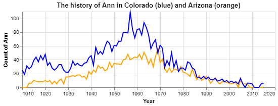

### CSE 250 Coding Challenge

__Samantha Staheli__

### Challenge Summary

_I answered every challenge question. The only thing I did not get done was the year line on the Ann chart._

#### Challenge 1

##### Answer:


#### Challenge 2

##### Answer:
|    |   year |   id_total |       total |   percent |
|---:|-------:|-----------:|------------:|----------:|
|  0 |   1978 |    14460   | 2.45557e+06 |  0.588866 |
|  1 |   1979 |    14924.5 | 2.55866e+06 |  0.583293 |
|  2 |   1980 |    15278.5 | 2.64366e+06 |  0.57793  |
|  3 |   1977 |    13977   | 2.46175e+06 |  0.567766 |
|  4 |   1981 |    14897.5 | 2.64723e+06 |  0.562758 |

#### Challenge 3

##### Answer:
|    |       0 |
|---:|--------:|
|  0 | 229.524 |
|  1 |  18     |
|  2 |  22     |
|  3 |  45     |
|  4 |  31     |
|  5 | 229.524 |
|  6 |  85     |
|  7 |  38     |
|  8 | 129     |
|  9 | 800     |
| 10 |  22     |
| 11 |   5     |

#### Challenge 4

##### Answer: 0.9223192019950125
code to make model:
```python
x_train, x_test, y_train, y_test = train_test_split(
features,
target,
test_size = .35,
random_state = 2021)

# create a classification model
classifier_RF = RandomForestClassifier()
# train the model
classifier_RF.fit(x_train, y_train)
# use your model to make predictions!
y_predicted = classifier_RF.predict(x_test)
# test how accurate those predictions are
metrics.accuracy_score(y_test, y_predicted)
```

#### Challenge 5

##### Answer: Change some column values
One column we would need to change is birth_decade because the year range is currently strings. I will change the year range to the first year in the range. The other columns we need to change are house and ancestry. I will change the values to numbers. 

changed year range:
```python
new_hp = hp
new_year = (new_hp.birth_decade
    .str.replace("\$|,|\+", "")
    .str.split("-", expand=True)
    .rename(columns = {0:'range'})
    .astype('float')
    .range
)
```

changed house values:
```python
new_house = (new_hp.house.
        str.replace('Gryffindor', '1').
        str.replace('Hufflepuff', '2').
        str.replace('Ravenclaw', '3').
        str.replace('Slytherin', '4').
        # rename(columns = {0:'new_house'})
        astype('float'))
```

changed ancestry values:
```python
new_ancestry = (new_hp.ancestry.
        str.replace('pure-blood', '1').
        str.replace('half-blood', '2').
        str.replace('muggleborn', '3').
        astype('float'))
```

##### Code

```python
 # %%
import pandas as pd
import altair as alt
import numpy as np

from sklearn.model_selection import train_test_split
from sklearn.ensemble import RandomForestClassifier
from sklearn import metrics

# %%
url_names = 'https://github.com/byuidatascience/data4names/raw/master/data-raw/names_year/names_year.csv'

dat_names = pd.read_csv(url_names)

# %% [markdown]
# ### Challenge 1

# %%
ann = dat_names.query('name == "Ann"')
# print(ann)
# ann.filter('name, year, AZ')

# %%
ann_az = (ann
.groupby('year')
.agg(az_total = ('AZ', sum)
)
# .assign(another_column_can_make = lambda x: function goes here)
.reset_index()
)
ann_az

# %%
ann_co = (ann
.groupby('year')
.agg(co_total = ('CO', sum)
)
# .assign(another_column_can_make = lambda x: function goes here)
.reset_index()
)
ann_co

# %%
chart_az = (alt.Chart(ann_az)
    .mark_line(color='orange')
    .encode(x = alt.X('year', axis = alt.Axis(format = 'd', title = 'Year')), 
            y = alt.Y('az_total', axis=alt.Axis(title = 'Count of Ann')))
    .properties(
        height = 150,
        width = 500,
        title = {'text': 'The history of Ann in Colorado (blue) and Arizona (orange)'}
    )
)
chart_az

# %%
chart_co = (alt.Chart(ann_co)
    .mark_line(color='blue')
    .encode(x = alt.X('year', axis = alt.Axis(format = 'd', title = 'Year')), 
            y = alt.Y('co_total', axis=alt.Axis(title = 'Count of Ann')))
    .properties(
        height = 150,
        width = 500,
        title = {'text': 'The history of Ann in Colorado (blue) and Arizona (orange)'}
    )
)
chart_co

# %%
chart_az + chart_co

# %% [markdown]
# ### Challenge 2

# %%
chal_2 = (dat_names
.groupby('year')
.agg(id_total = ('ID', sum),
    total = ('Total', sum)
)
.assign(percent = lambda x: (x.id_total / x.total)*100)
.sort_values(by = 'percent', ascending = False)
.reset_index()
)
first5 = chal_2.head(5)
print(first5.to_markdown())

# %% [markdown]
# ### Challenge 3

# %%
bob = pd.Series([np.nan, 18, 22, 45, 31, np.nan, 85, 38, 129, 800, 22, 5])
dev = bob.dropna()
st_dev = np.std(dev)
chal3 = bob.replace(np.nan, st_dev)
print(chal3.to_markdown())

# %% [markdown]
# ### Challenge 4

# %%
dwellings_ml = pd.read_csv("https://github.com/byuidatascience/data4dwellings/raw/master/data-raw/dwellings_ml/dwellings_ml.csv")

features = dwellings_ml.drop(['numbaths','parcel'], axis = 1)
target = (dwellings_ml.numbaths > 2)*1

# %%
x_train, x_test, y_train, y_test = train_test_split(
features,
target,
test_size = .35,
random_state = 2021)

# %%
# create a classification model
classifier_RF = RandomForestClassifier()
# train the model
classifier_RF.fit(x_train, y_train)
# use your model to make predictions!
y_predicted = classifier_RF.predict(x_test)
# test how accurate those predictions are
metrics.accuracy_score(y_test, y_predicted)


# %% [markdown]
# ### Challenge 5

# %%
hp = pd.DataFrame({'name': ['Harry Potter','Hermione Granger','Ron Weasley','Draco Malfoy','Minerva McGonagall','Severus Snape','Rubeus Hagrid','Cedric Diggory','Ginny Weasley','Lord Voldemort'],'house': ['Gryffindor','Gryffindor','Gryffindor','Slytherin','Gryffindor','Slytherin','Gryffindor','Hufflepuff','Gryffindor','Slytherin'],'birth_decade': ['1980-1989', '1970-1979', '1980-1989', '1980-1989', '1920-1929', '1960-1969', '1920-1929', '1970-1979', '1980-1989', '1920-1929'],'ancestry': ['half-blood','muggleborn','pure-blood','pure-blood',np.nan,'half-blood','half-blood','pure-blood','pure-blood','half-blood'],'hogwartsStudent': [True,True,True,True,False,False,False,True,True,False]})

hp

# %%
new_hp = hp
new_house = (new_hp.house.
        str.replace('Gryffindor', '1').
        str.replace('Hufflepuff', '2').
        str.replace('Ravenclaw', '3').
        str.replace('Slytherin', '4').
        # rename(columns = {0:'new_house'})
        astype('float'))
new_house

# %%
new_year = (new_hp.birth_decade
    .str.replace("\$|,|\+", "")
    .str.split("-", expand=True)
    .rename(columns = {0:'range'})
    .astype('float')
    .range
)
new_year

# %%
new_ancestry = (new_hp.ancestry.
        str.replace('pure-blood', '1').
        str.replace('half-blood', '2').
        str.replace('muggleborn', '3').
        astype('float'))
new_ancestry
```